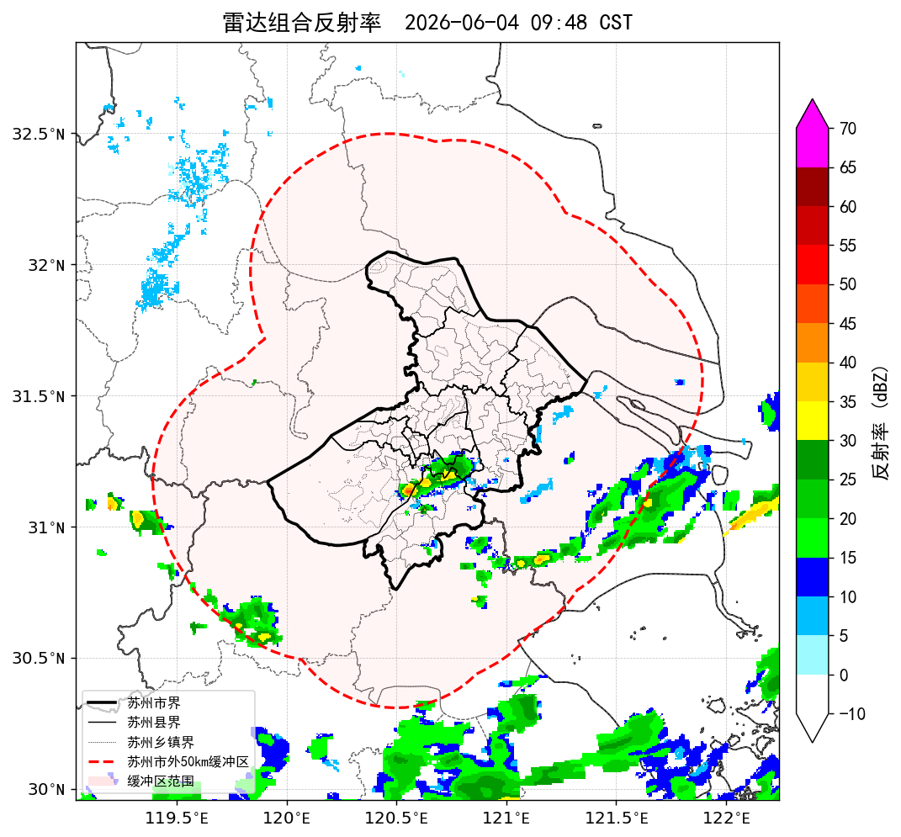

# 雷达强对流预警推送 — 接口对接说明

> 我方为**推送方**，向贵方自建接收端 `POST` 一份 JSON。本文档说明数据格式并附样例。
> 标注 **【待贵方提供】** 的内容请贵方填写后回传给我们。

---

## 一、对接信息（待贵方提供）

| 项目 | 内容 |
|------|------|
| 接收地址（URL） | **【待贵方提供】** 形如 `https://your-host/api/radar/alert` |
| 鉴权方式 | **【待贵方提供】** 如无需鉴权可留空；如需要，请说明（如 `Authorization: Bearer <token>`，token 由贵方提供） |
| 其他要求 | **【待贵方提供】** 如有 IP 白名单、特殊请求头等请说明 |

我方固定使用：

- 请求方法：`POST`
- 请求头：`Content-Type: application/json; charset=utf-8`
- 每次预警推送一条 JSON（文案 + 结构化字段 + 图片）

---

## 二、推送数据格式（JSON）

```json
{
  "event": "radar.strong_convection.alert",
  "id": "20260604014800",
  "observe_time": "2026-06-04T09:48:00+08:00",
  "publisher": "苏州市气象台",
  "will_affect_city": true,
  "level_dbz": 45,
  "direction": "东南",
  "trend": "增强",
  "source": {
    "upstream": ["无锡", "常州"],
    "local_districts": ["相城区"]
  },
  "convective_phenomena": ["短时强降水", "雷暴大风"],
  "affected": [
    { "district": "相城区", "townships": ["黄埭镇", "太平街道"] },
    { "district": "吴中区", "townships": ["甪直镇"] }
  ],
  "text": "【AI预报员短临提醒】\n监测实况：无锡、常州方向有对流云团正在发展，雷达回波强度达≥45dBZ。\n预报：未来一小时回波向东南方向移动、强度逐渐增强，相城区黄埭镇、太平街道、吴中区甪直镇将出现雷电活动，部分地区可能伴有短时强降水、雷暴大风等强对流天气，请做好防范。\n苏州市气象台2026年6月4日09:48发布",
  "image": {
    "format": "png",
    "md5": "9a1b2c3d4e5f6071829304a5b6c7d8e9",
    "base64": "<PNG 图片的 base64 字符串>"
  }
}
```

### 字段说明

| 字段 | 类型 | 说明 |
|------|------|------|
| `event` | string | 事件类型，固定 `radar.strong_convection.alert` |
| `id` | string | 本次预警唯一标识（实况时间戳，可用于去重） |
| `observe_time` | string | 实况时刻，ISO8601 带时区（北京时间 +08:00） |
| `publisher` | string | 发布单位 |
| `will_affect_city` | bool | 是否影响本市 |
| `level_dbz` | int | 强度等级（dBZ） |
| `direction` | string | 移动方向，八方位或"少动" |
| `trend` | string | 趋势：`增强` / `减弱` / `维持` |
| `source.upstream` | string[] | 上游来源城市，可为空数组 |
| `source.local_districts` | string[] | 本地已生成强回波的区县，可为空数组 |
| `convective_phenomena` | string[] | 对流天气现象；不影响本市时为空数组 |
| `affected` | object[] | 受影响区县及乡镇（仅市内）；不影响本市时为空数组 |
| `text` | string | 成品中文文案，可直接展示/转发（见样例） |
| `image.format` | string | 图片格式，固定 `png` |
| `image.md5` | string | 图片原始字节 md5 |
| `image.base64` | string | 图片 base64 编码（雷达实况图，见样例） |

### 期望响应

贵方接收成功请返回 HTTP `2xx`。我方据此判断是否成功，失败会记录日志。

---

## 三、样例

### 3.1 样例文案（会影响本市）

```
【AI预报员短临提醒】
监测实况：无锡、常州方向有对流云团正在发展，雷达回波强度达≥45dBZ。
预报：未来一小时回波向东南方向移动、强度逐渐增强，相城区黄埭镇、太平街道、吴中区甪直镇将出现雷电活动，部分地区可能伴有短时强降水、雷暴大风等强对流天气，请做好防范。
苏州市气象台2026年6月4日09:48发布
```

### 3.2 样例文案（对本市无明显影响）

```
【AI预报员短临提醒】
监测实况：上海方向有对流云团正在发展，雷达回波强度达≥40dBZ。
预报：未来一小时回波向东方向移动、强度基本维持，移动路径对我市无明显影响。
苏州市气象台2026年6月4日09:48发布
```

### 3.3 样例图片

`image.base64` 解码后即为下图（雷达组合反射率实况图，PNG）：


